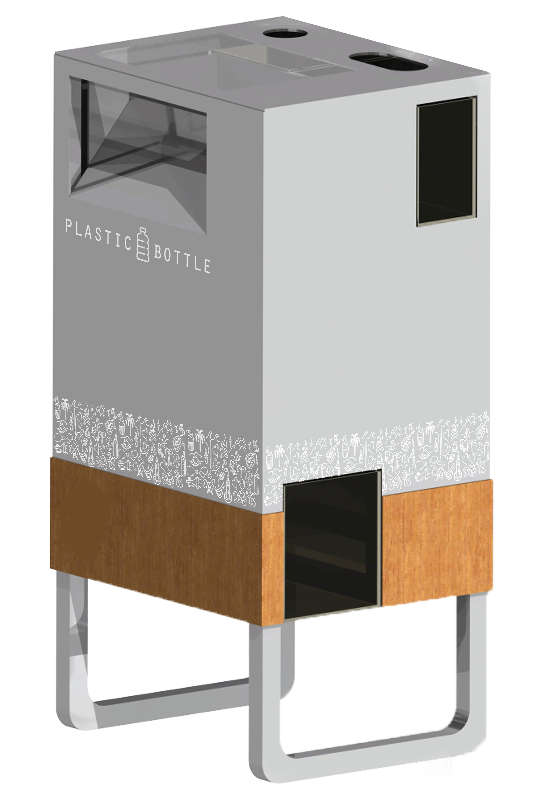

# Components & Estimates

General overview for a PET bottle vending shredder machine.

[Shredder Test Videos](https://www.morrentrading.com/shredder-s/basis-shredderblok-am2018-200 https://www.morrentrading.com/movies)

[Shredder Pictures](https://www.morrentrading.com/shredder-s/basis-shredderblok-am2018-20)

[Shredder firmware](https://github.com/plastic-hub/firmware/blob/master/shredder-extrusion/README.md)

## Features of the first revision

- IP55 grade housing and electronics
- sound prove
- auto - suspend/resume
- air filters & ventilation
- auto - reverse
- load capacity : 4 large PET bottles at a time
- transport wheels
- auto-shred when hopper is loaded
- LED & audio feedback
- minimal user interface
- power meter
- service & maintenance interface via USB developer port
- 2 cartridges: one big one for PET, one for the bottle caps/lids. both have wheels and a spring loaded door.
- service door for cleaning

### Optional features

- large touchscreen for network KPIs and shredding profiles
- key lock
- haptic buttons
- remote interface (IoT) for online metering
- plastic scanner

   |  **Component Name** | **Component Section** | **Component Price/Estimate** | **Production/Duration (hours)** | **Design/Prototyping-Duration (hours)** | **Picture/Video References** | **Status** | **Risk** |
| --- | --- | --- | --- | --- | --- | --- | --- |
|  Shredder Box | Shredding | 1450 | 24 | 12 | https://www.morrentrading.com/shredder-s/basis-shredderblok-am2018-200 https://www.morrentrading.com/movies | Solved |  |
|  Coupling | Drive | 120 | 4 | 10 |  | Design |  |
|  Hopper | Feed | 150 | 6 | 16 |  | Design |  |
|  Shredder/Motor-Mounts | Framework |  |  |  |  |  |  |
|  Motor | Motor | 560 | 1 | 2 |  | Solved |  |
|   |  |  |  |  |  |  |  |
|  Chassie/Enclosure | Framework | 300 | 16 | 24 |  |  | High |
|  Panels | Skinning |  | 5 | 10 |  |  | High |
|  Ventilation & Airfilter | Framework | 200 | 8 | 16 |  | Design |  |
|  Segment Joinery | Framework | 150 | 10 | 16 |  | Design | High |
|  Cartridges | Framework | 200 | 10 | 10 |  | Design | Middle |
|  Wheels & mounts | Framework | 100 | 4 | 1 |  | Design | Middle |
|   |  |  |  |  |  |  |  |
|  Chassie- Sensors | Electronics | 100 | 5 | 10 | https://github.com/plastic-hub/firmware/blob/master/shredder-extrusion/README.md | Solved |  |
|  Motor Heat Sensors | Electronics | 30 | 2 | 2 | https://github.com/plastic-hub/firmware/blob/master/shredder-extrusion/README.md | Solved |  |
|  Auto-Reverse | Electronics | 50 | 4 | 2 | https://github.com/plastic-hub/firmware/blob/master/shredder-extrusion/README.md | Solved |  |
|  Feed - Sensor | Electronics | 50 | 2 | 2 | https://github.com/plastic-hub/firmware/blob/master/shredder-extrusion/README.md | Solved |  |
|  Cartridges - Full Sensor | Electronics | 20 | 1 |  | https://github.com/plastic-hub/firmware/blob/master/shredder-extrusion/README.md |  |  |
|  LED Feedback | Electronics | 100 | 3 | 5 | https://github.com/plastic-hub/firmware/blob/master/shredder-extrusion/README.md | Not tested |  |
|  Audio Feedback | Electronics | 10 | 1 | 1 | https://github.com/plastic-hub/firmware/blob/master/shredder-extrusion/README.md | Solved |  |
|  Suspend/Resume | Electronics | 100 | 3 | 10 | https://github.com/plastic-hub/firmware/blob/master/shredder-extrusion/README.md | Not impl. | Middle |
|  Inverter | Electronics | 250 | 2 | 1 | https://github.com/plastic-hub/firmware/blob/master/shredder-extrusion/README.md | Solved | Middle |
|   |  |  |  |  |  |  |  |
|  Control - Board / Fuses/,... | Electronics | 200 | 5 | 1 |  | Solved | Middle |
|   |  |  |  |  |  |  |  |
|  Sourcing,... | Logistics | 150 | 10 |  |  |  |  |
|   |  | 4290 | 126 | 151 |  |  |  |

## References
